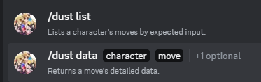

+++
title = 'heartblazer'
description = "Discord bot providing utility for an FGC server"
toc = true
status = "Upkeep"
type = "project"
+++

-> Minimal discord chatbot application providing utility for a local FGC server. \
-> Built with the JDA5 discord API wrapper. \
-> Allows pin-management for thread-owners within event- and advice-forums. \
-> Integrates with [Dustgrain](/projects/dustgrain) for easy data lookup straight from discord. \
-> Provides a functional base for future expansion if necessary.

## /links

- https://github.com/cheiily/HeartBlazer
<!-- - [Dustgrain Integration](/projects/heartblazer-dustgrain) -->

## /motivation

HaB is the european community central for Granblue Fantasy Versus and GBVS: Rising (with sections for a few other games like GGXRD). It's often used as *the* tournament hub, containing forum threads for each tournament, as well as a help forum for players struggling with progress. Discord's permission system requires `Manage Messages` to be given out before a user can pin/unpin a message in any channel/thread but, as you can imagine, it also brings other, more significant, permissions with it that should not be given out lightly. Because of this, pinning messages (whether for visibility or highlighting important pieces of advice in help threads) used to be a task requiring moderation support. \
This app's main motivation was providing this utility of partial message management to thread owners (only). \
Later it also helped facilitate dustgrain as a quick-lookup of frame data from dustloop.

## /technologies

- Java 17
- JDA 5
- Gradle build system

## /implementation

Having dabbled some with discord bot development via JDA 4, this looked like a single afternoon project. The main effort would go into authorization / thread-ownership verification and, in its most basic form, proved to meet the timeframe expectations.
I decided to expand the app's base a bit to work as a slightly generalized framework in case there were other commands to be added in the future. \
The app loads a number of basic configuration values from a config file on startup, such as owner id, token, a list of moderator and administrator ids, a prefix for DM-only authorized commands, such as config reload and shutdown.
The authtorization pipeline consists of 5 different levels in the base implementation and all commands have their base level requirement as well as context-specific evaluated requirements. \
The commands use an `Action` base, which allows for different type of request triggers, including DM, emoji-reaction, slash command, message-context action and user-context action. \
A conveniency log-context system is also used by the action handler.

## /conclusions

The application correctly provides its main inteded feature to this day, while running on a private server of mine.
 \
The expansion of its base engine also proved useful for later integrating with dustgrain.

