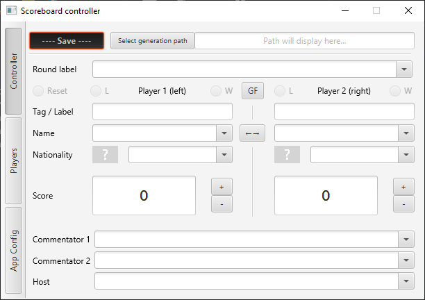

+++
title = 'scoreboard'
description = "JavaFX app for managing tournament streaming overlays"
toc = true
status = "v0.2"
type = "project"
+++

Note: My focus was temporarily stolen away by [DustGrain](/projects/dustgrain), but this should see some action in the coming months again.

GUI Application made with JavaFX. \
The application is a tool for Tournament Organizers to help manage streaming overlays for match scoreboards. \
Allows loading, selection, modification of relevant match data with output in the specified path. Allows loading and in-app edition of relevant player data, commentary data, round labeling, etc. \
Planned features for full release include web-overlays hosted locally, and data import from tournament management websites such as challonge.

The project has been under development since spring 2023 and is working towards the first full release, with a couple pre-release builds available. \

## /links

- https://github.com/cheiily/FGC_Scoreboard_filegen

## /motivation

Getting into the FGC I became interested in organizing a tournament or two myself, however managing OBS text elements manually seemed like a less than perfect way to manage the overlay. Looking into any pre-existing controllers, I had not found anything notable available free of charge and that's how the idea came to be. \
I was later informed of TSH, which is a great piece software but personally I found it slightly overloaded & confusing to use and customize. Hence, this is remaining an active project for the forseeable future.

## /technologies

- Java 17
	- Maven
- JavaFX
	- Scenebuilder
- Ini4j
- OpenCSV

## /operation

The basic functionality is contained within the controller tab.

There the user can select any of the pre-loaded players and their related data, or write it down manually.
The players' related data encompasses: their name/handle, an organization tag and their nationality. The nationality helps select a flag image to be saved into the output folder. Flags are loaded from a separate folder and can be customized to include any sort of images desired, including pride flags, memes, sub-region flags, etc. Currently the flags do not come with the package, but as they belong to the public domain, an optional download will be included in future releases. That covers player data.

Round data includes the current round label e.g. "Winners Semi-finals", Grand Finals indicators ('[L]' for the player coming from losers bracket, or both during the 'bracket reset') and score for both players. Similar to the combo boxes, the score can be written in manually, scrolled-through or incremented and decremented via the dedicated control buttons.
A preset of default round labels comes with the app but can also be customized for the app to load. (Of course, the labels can also be written in manually.)

General data includes 2 commentator slots and a host slot, with suggestions also pre-loaded from the config directory.

The remaining two tabs are still work-in-progress:
	• 'Players' allows in-app player data edition, that is then loaded into the drop-down and autocomplete suggestions. In the future external site (like https://challonge.com) bracket import/export might also happen here.
	• 'App config' allows configuration of behaviors like autocomplete suggestions, flag image output, output format selection, etc.

## /implementation

The Graphical User Interface & controller for this app is built with JavaFX, with each of the three main scenes containing their own controlller. These controllers converse with the app's own data manager, responsible for saving data with the help of OutputWriters and OutputFormatters; as well as reading from the provided directory layout. \
As of now the controller's data is still held within the loaded ini file representation and the app's central data manager enables interfacing with that. It is a planned change for a more direct round data structure control, that will only utilize Ini4j for initialization and data dump on-save. \
There is a number of properties for behavior, output, input configuration. These are loaded from a number of .ini and .csv format files - directly configured by the user as a way of bulk data import. \
There is also a number of convenience features, such as scroll-operated combo boxes and search suggestions/autocomplete, the latter being handled by a wrapper to the JFX structure.

Note: the initial implementation for DataWebSocket (not yet used) was kindly provided by @Jakkzero, a friend from within the EU GBVS community.

## /conclusions

Other than for me during my own tournaments, the app has proven to at least one other community member, one of the the currently active TO's - a similarminded person not appreciative of TSH's complicated layout. That alone has been a great motivation to keep working on and improving the controller further. :)
